<!-- column_layout: [4, 5] -->

<!-- column: 0 -->

<!-- new_lines: 1 -->


<!-- column: 1 -->

<!-- pause -->

<!-- new_lines: 1 -->

### **Michał Czyż**

👨🏻‍💻 Informatyka @ Politechnika Śląska

🛩️ Członek SKN vFly

🦀 Programista

🐧 Linux Enthusiast

---

https://c2yz.com 

https://github.com/eRgo35 

https://www.linkedin.com/in/mike-czyz

<!-- end_slide -->


<!-- pause -->

The Rust Programming Language 🦀
===

<!-- end_slide -->

<!-- new_lines: 3-->

<!-- column_layout: [5, 4] -->

<!-- column: 0 -->


<!-- column: 1 -->

# **Rust**

Język pozwalający każdemu na tworzenie niezawodnego i wydajnego oprogramowania.

Tak! Twój kod może być bezpieczny i szybki!

<!-- end_slide -->

<!-- new_lines: 3 -->


<!-- pause -->

Puccinia recondita f.sp. tritici on Triticum aestivum
===

<!-- end_slide -->

<!-- new_lines: 1 -->

> \<graydon> >> I love the name. I take it that it refers to your scavenging the
> \<graydon> >> skeletal hulks of dead languages, now covered in vines...?
> \<graydon> >
> \<graydon> > A little. Also big metallic things. And rusts and smuts, fungi. And it's a
> \<graydon> > nice substring of "robust".
> \<jonanin> hah
> \<jonanin> interesting
> \<graydon> IOW I don't have a really good explanation. it seemed like a good name. (also a substring
>           of "trust", "frustrating", "rustic" and ... "thrust"?)
> \<graydon> I think I named it after fungi. rusts are amazing creatures.
> \<graydon> Five-lifecycle-phase heteroecious parasites. I mean, that's just _crazy_.
> \<graydon> talk about over-engineered for survival
> \<jonanin> what does that mean? :]
> \<graydon> fungi are amazingly robust

<!-- end_slide -->

# Dlaczego Rust?

<!-- new_lines: 1 -->

<!-- column_layout: [3, 3, 3] -->

<!-- pause -->

<!-- column: 0 -->

## Bezpieczeństwo


<!-- pause -->

<!-- column: 1 -->

## Wydajność


<!-- pause -->

<!-- column: 2 -->

## Wygoda

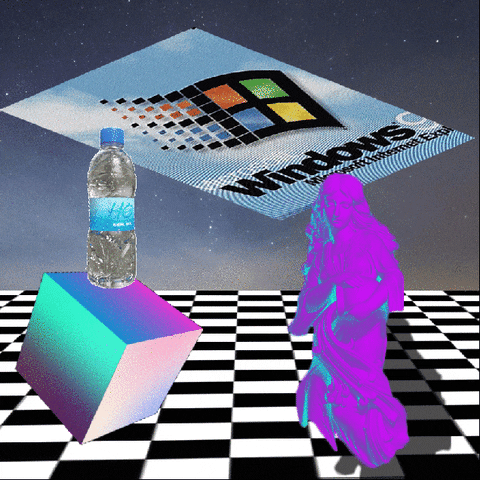

<!-- end_slide -->

## Bezpieczeństwo

W `C` musimy być bardzo ostrożni

<!-- pause -->

```c 
char buffer[10]; // przepełnienie bufora
strcpy(buffer, "Bardzo dlugi tekst!");
```

<!-- pause -->

```c 
int *ptr = malloc(sizeof(int));
free(ptr); // wiszący wskaźnik
```

<!-- pause -->

```c 
void memory_leak() 
{ 
    int *leak = malloc(sizeof(int)); 
    // zapomnieliśmy o free 
}
```

<!-- end_slide -->

## Bezpieczeństwo

Przepełnienie bufora w `Rust` jest przez nas zauważalne

<!-- pause -->

```rust 
let mut buffer = [0; 10];
buffer.copy_from_slice("Bardzo dlugi tekst!".as_bytes());
```

<!-- pause -->

```bash
❯ cargo run
   Compiling playground v0.1.0 (/home/mike/repos/playground)
    Finished `dev` profile [unoptimized + debuginfo] target(s) in 0.07s
     Running `target/debug/playground`

thread 'main' panicked at src/main.rs:3:12:
copy_from_slice: source slice length (19) does not match destination slice length (10)
note: run with `RUST_BACKTRACE=1` environment variable to display a backtrace
```
<!-- end_slide -->

## Bezpieczeństwo

W `C` otrzymalibyśmy coś takiego

```bash
❯ gcc main.c -o main
main.c: In function ‘main’:
main.c:5:3: warning: ‘__builtin_memcpy’ writing 20 bytes into a region of size 10 overflows the destination [-Wstringop-overflow=]
    5 |   strcpy(buffer, "Bardzo dlugi tekst!");
      |   ^~~~~~~~~~~~~~~~~~~~~~~~~~~~~~~~~~~~~
main.c:4:8: note: destination object ‘buffer’ of size 10
    4 |   char buffer[10]; // przepełnienie bufora
      |        ^~~~~~
```

<!-- pause -->

Ale chwila! Przecież `gcc` też nas ostrzega!

<!-- end_slide -->

## Bezpieczeństwo

```bash
❯ ./main
*** stack smashing detected ***: terminated
fish: Job 1, './main' terminated by signal SIGABRT (Abort)
```
<!-- end_slide -->

## Bezpieczeństwo

Uczyńmy małe utrudnienie

```c 
#include <string.h>

const char *get_long_string() { 
    return "Bardzo dlugi tekst!"; 
}

int main() {
  char buffer[10];
  strcpy(buffer, get_long_string()); // Oops!
}

```

<!-- end_slide -->

## Bezpieczeństwo

```bash
❯ gcc main.c -o main

❯ ./main
*** stack smashing detected ***: terminated
fish: Job 1, './main' terminated by signal SIGABRT (Abort)
```

<!-- end_slide -->

## Bezpieczeństwo

A jak poradzi sobie `Rust`?

```rust
const fn get_long_string() -> &'static str {
    "Bardzo dlugi tekst!"
}

fn main() {
    let mut buffer = [0; 10];
    buffer.copy_from_slice(get_long_string().as_bytes());
}
```

<!-- end_slide -->

## Bezpieczeństwo

```bash
❯ cargo run
   Compiling playground v0.1.0 (/home/mike/repos/playground)
    Finished `dev` profile [unoptimized + debuginfo] target(s) in 0.09s
     Running `target/debug/playground`

thread 'main' panicked at src/main.rs:7:12:
copy_from_slice: source slice length (19) does not match destination slice length (10)
note: run with `RUST_BACKTRACE=1` environment variable to display a backtrace

```

<!-- end_slide -->

## Bezpieczeństwo

### Ownership - każda dana ma tylko jednego właściciela

```rust 
fn main() { 
  let s = String::from("Hello, Rust!"); 
  // s jest automatycznie zwalniane gdy opuści blok 
}
```

<!-- pause -->

### Borrowing - można pożyczać dane bez zmiany ich właściciela

```rust 
fn main() {
  let s = String::from("Hello, Rust!");
  let r = &s; // r jest referencją do s 
  println!("{}", r); // używamy r
}
```

<!-- end_slide -->

## Bezpieczeństwo

### Brak pustych wskaźników - zamiast tego mamy typ `Option`

```rust
fn main() { 
  let jakas_wartosc: Option<i32> = Some(10); 
  let brak_wartosci: Option<i32> = None; 
}
```

<!-- end_slide -->

## Bezpieczeństwo

Próba zmiany wzkaźnika:
```rust 
fn main() { 
  let mut x = 5; 
  let y = &mut x; // y jest mutowalnym wskaźnikiem do x 
  *y += 1; // zmieniamy wartość x przez y 
  println!("{}", x); // wypisujemy x
}
```

```bash 
❯ ./target/debug/playground 
6
```

Musimy określić, że `x` jest mutowalny i `y` jest mutowalnym wskaźnikiem do `x`
===

<!-- end_slide -->

## Wydajność


<!-- end_slide -->

## Wydajność

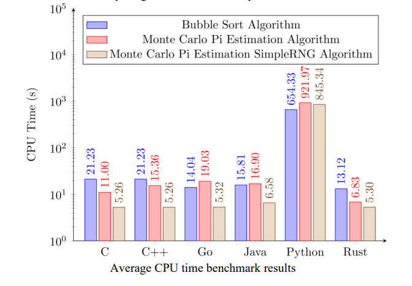

<!-- end_slide -->

## Wydajność

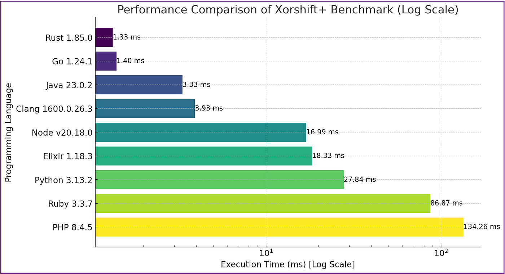

<!-- end_slide -->

<!-- column_layout: [4, 5] -->

<!-- column: 0 -->

<!-- new_lines: 1 -->


<!-- column: 1 -->

<!-- pause -->

## Wydajność vs Wygoda

Funkcje wysokopoziomowe wcale nie muszą być wolne!
===

```rust 
fn main() {
    let numbers = vec![1, 2, 3];
    let sum: i32 = numbers.iter().sum();
    println!("Suma: {}", sum);
}
```

<!-- end_slide -->

## Wydajność vs Wygoda

Statements vs. Expressions
===

```rust 
if x {
  y = a;
} else {
  y = b;
}

y = if x { a } else { b };
```

<!-- end_slide -->

<!-- column_layout: [5, 4] -->

<!-- column: 1 -->

<!-- new_lines: 1 -->

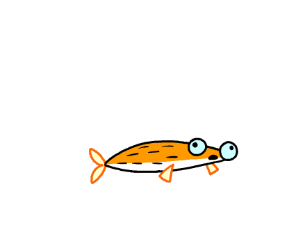

<!-- pause -->

<!-- column: 0 -->

## Wydajność vs Wygoda

Iteratory
===

```rust
(1..10).map(f)

names.iter().filter(|x| x.starts_with("A"))
```

<!-- end_slide -->

## Wydajność vs Wygoda

Opcje
===

```rust 
let x = Some(5);

x.map(|n| n * 2)
.unwrap_or(0);
```

<!-- end_slide -->

## Wydajność vs Wygoda

System struktur i typów enumerowanych
===

```rust 
enum Day {
Sunday, Monday, Tuesday, Wednesday, 
Thursday, Friday, Saturday
}
enum Status {Active, Inactive}

struct Event {
  name: String,
  day: Day,
  status: Status,
}
```

<!-- end_slide -->

## Wydajność vs Wygoda

System struktur i typów enumerowanych
===

```rust 
let wykład = Event {
  name: String::from("Nie taki zardzewiały jak myślisz - odkryj potencjał Rusta"),
  day: Day::Monday,
  status: Status::Active,
};
```


<!-- end_slide -->

## Wydajność vs Wygoda

Asynchroniczność
===

```javascript 
const response = await fetch('https://api.example.com/data');
const data = await response.json();

console.log(data);
```

<!-- end_slide -->

## Wydajność vs Wygoda

Asynchroniczność
===

```rust 
let response = reqwest::get("https://api.example.com/data")
    .await
    .unwrap();
let data = response.json::<serde_json::Value>()
    .await
    .unwrap();

println!("{:?}", data);
```

<!-- end_slide -->

## Kompilator

```rust 
fn main() {
    // TODO: Fix the code to print "Hello world!".
    printline!("Hello world!");
}
```

<!-- end_slide -->

## Kompilator

```bash 
❯ cargo run
   Compiling playground v0.1.0 (/home/mike/repos/playground)
error: cannot find macro `printline` in this scope
   --> src/main.rs:3:5
    |
3   |     printline!("Hello world!");
    |     ^^^^^^^^^ help: a macro with a similar name exists: `println`
    |
   ::: /home/mike/.rustup/toolchains/nightly-x86_64-unknown-linux-gnu/lib/rustlib/src/rust/library/std/src/macros.rs:138:1
    |
138 | macro_rules! println {
    | -------------------- similarly named macro `println` defined here

error: could not compile `playground` (bin "playground") due to 1 previous error
```

<!-- end_slide -->

## Ekosystem

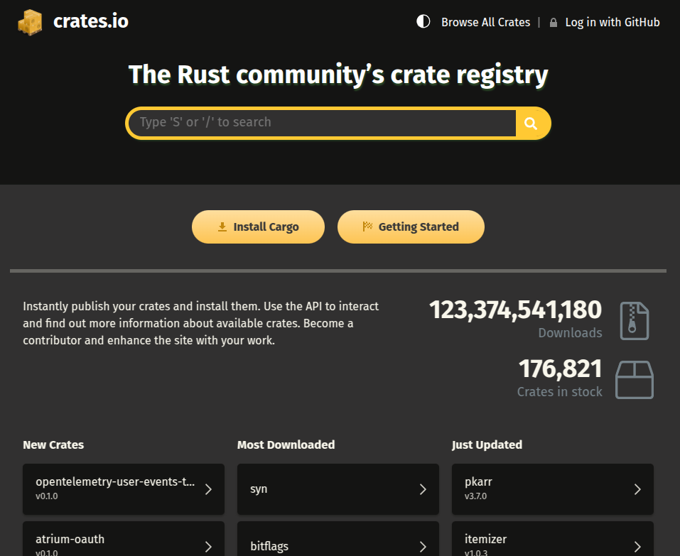

<!-- end_slide -->

## Ekosystem

```bash 
❯ cargo add <nazwa_pakietu>
```

<!-- pause -->

```bash 
❯ cargo install <nazwa_pakietu>
```

<!-- end_slide -->

## Ekosystem

```
❯ cargo --help
Rust's package manager

Usage: cargo [+toolchain] [OPTIONS] [COMMAND]
       cargo [+toolchain] [OPTIONS] -Zscript <MANIFEST_RS> [ARGS]...

Commands:
    build, b    Compile the current package
    check, c    Analyze the current package and report errors, but don't build object files
    clean       Remove the target directory
    doc, d      Build this package's and its dependencies' documentation
    new         Create a new cargo package
    init        Create a new cargo package in an existing directory
    add         Add dependencies to a manifest file
    remove      Remove dependencies from a manifest file
    run, r      Run a binary or example of the local package
    test, t     Run the tests
    bench       Run the benchmarks
    update      Update dependencies listed in Cargo.lock
    search      Search registry for crates
    publish     Package and upload this package to the registry
    install     Install a Rust binary
    uninstall   Uninstall a Rust binary
    ...         See all commands with --list

See 'cargo help <command>' for more information on a specific command.

```

<!-- end_slide -->

## Ekosystem

<!-- column_layout: [4, 2] -->

<!-- column: 0 -->

Clippy
===

```rust 
fn main() {
    // TODO: Fix the Clippy lint in this line.
    let pi = 3.14;
    let radius: f32 = 5.0;

    let area = pi * radius.powi(2);

    println!("The area of a circle with radius {radius:.2} is {area:.5}");
}
```

<!-- column: 1 -->

<!-- new_lines: 3 -->

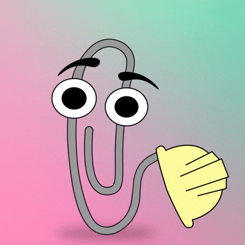

<!-- end_slide -->

## Ekosystem

Clippy
===

```bash
❯ cargo clippy
    Checking playground v0.1.0 (/home/mike/repos/playground)
error: approximate value of `f{32, 64}::consts::PI` found
 --> src/main.rs:3:14
  |
3 |     let pi = 3.14;
  |              ^^^^
  |
  = help: consider using the constant directly
  = help: for further information visit https://rust-lang.github.io/rust-clippy/master/index.html#approx_constant
  = note: `#[deny(clippy::approx_constant)]` on by default

error: could not compile `playground` (bin "playground") due to 1 previous error
```

<!-- end_slide -->

## Zarządzanie bibliotekami

<!-- column_layout: [3, 3] -->

<!-- column: 0 -->

`Cargo.toml`

```toml
[package]
name = "playground"
version = "0.1.0"
edition = "2024"

[dependencies]
ratatui = "0.29.0"
reqwest = "0.12.15"
serde = "1.0.219"
serde_json = "1.0.140"
```

<!-- column: 1 -->

<!-- new_lines: 3 -->

```bash 
❯ cargo add ratatui serde serde_json reqwest
```


<!-- end_slide -->

## Zarządzanie bibliotekami

<!-- column_layout: [3, 3] -->

<!-- column: 0 -->

C/C++
===

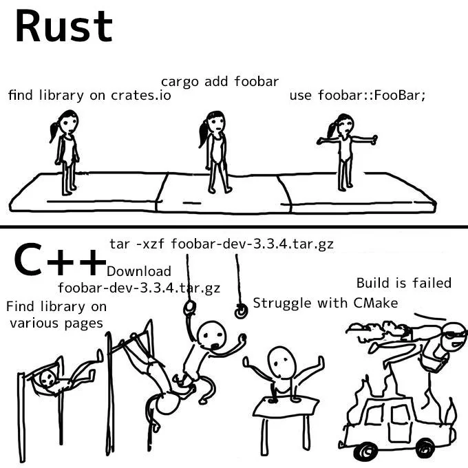

<!-- column: 1 -->

JavaScript 
===


<!-- end_slide -->

## Pozwólcie im gotować!

Wspaniałe programy, narzędzia i biblioteki napisane w Rust!
===


<!-- end_slide -->

## Wezterm

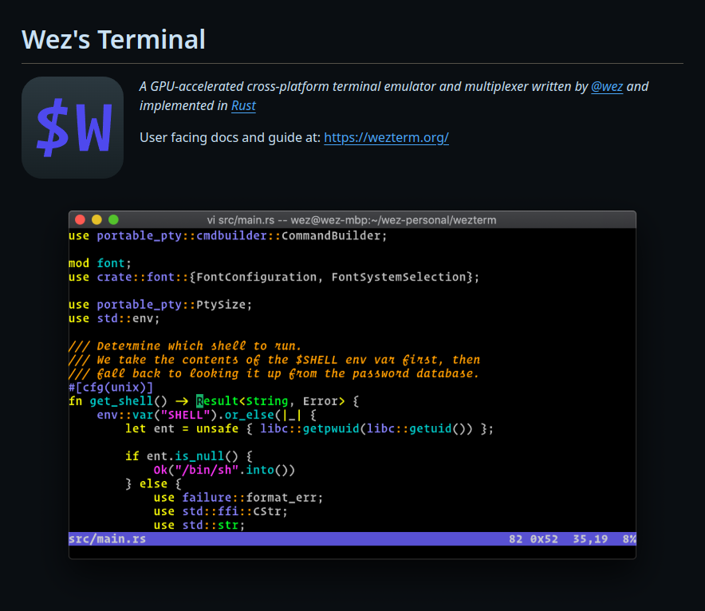

<!-- end_slide -->

## Zellij 

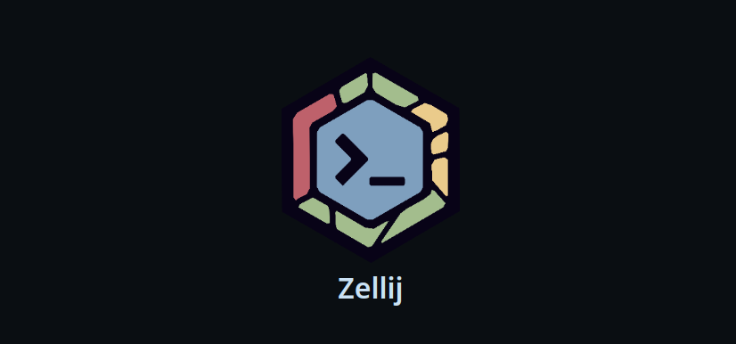


<!-- end_slide -->

## ncspot 

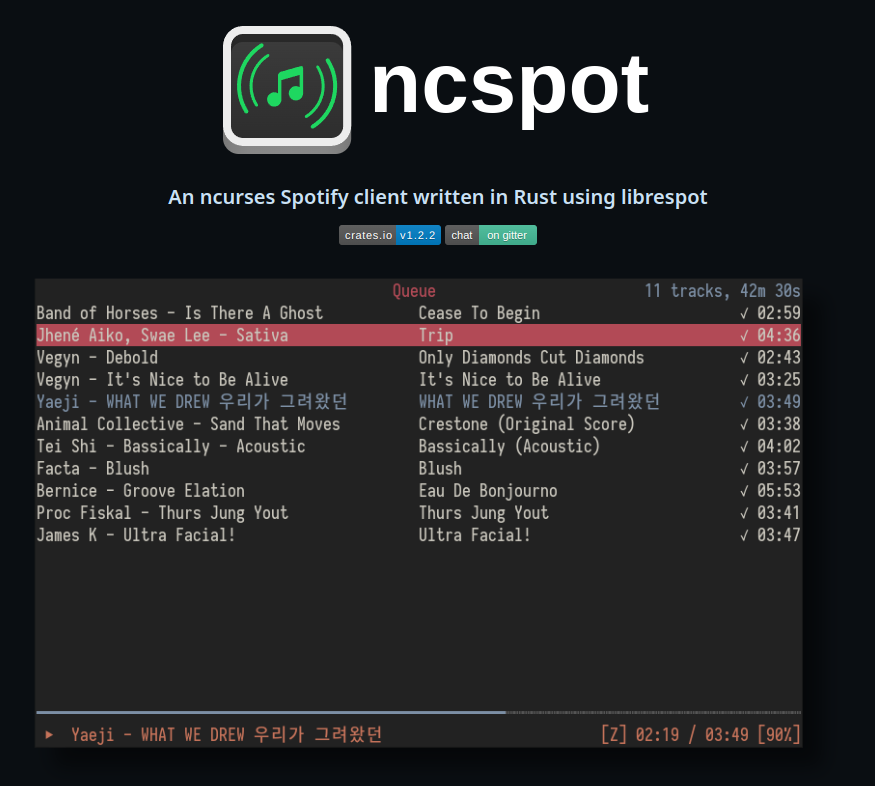

<!-- end_slide -->

## ripgrep

<!-- new_lines: 3 -->


<!-- end_slide -->

## RMK


<!-- new_lines: 3 -->

<!-- column_layout: [3, 3] -->

<!-- column: 0 -->


<!-- column: 1 -->

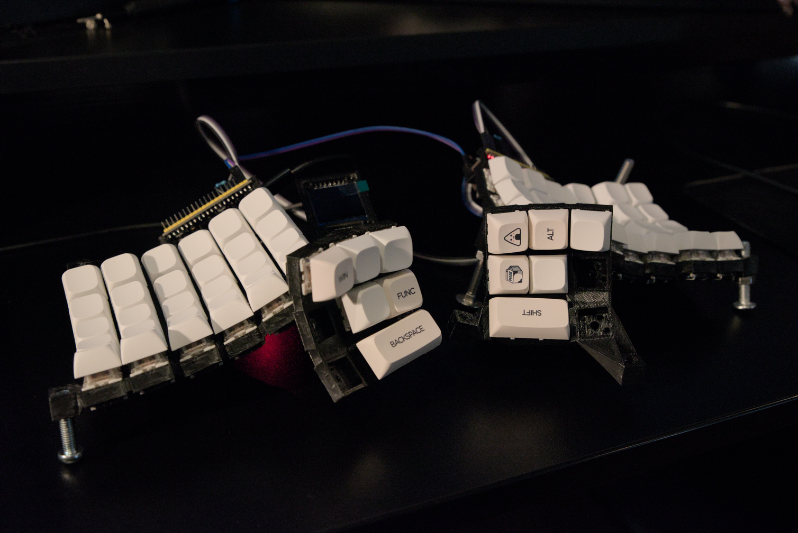

<!-- end_slide -->

## MartyPC

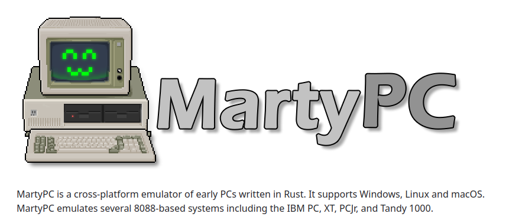

<!-- end_slide -->

## Ruffle

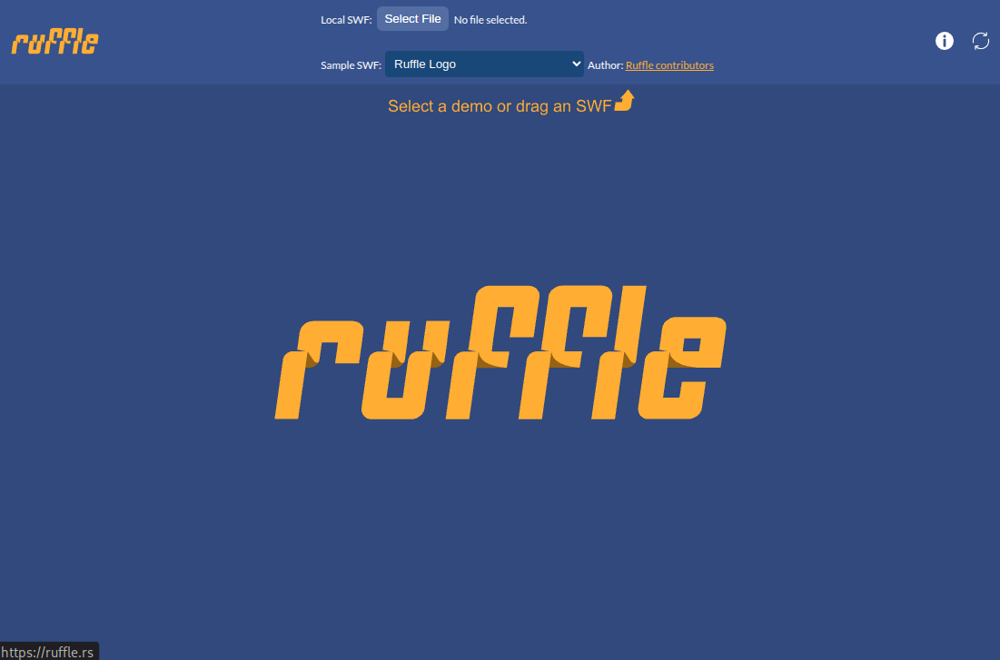

<!-- end_slide -->

## Helix Editor

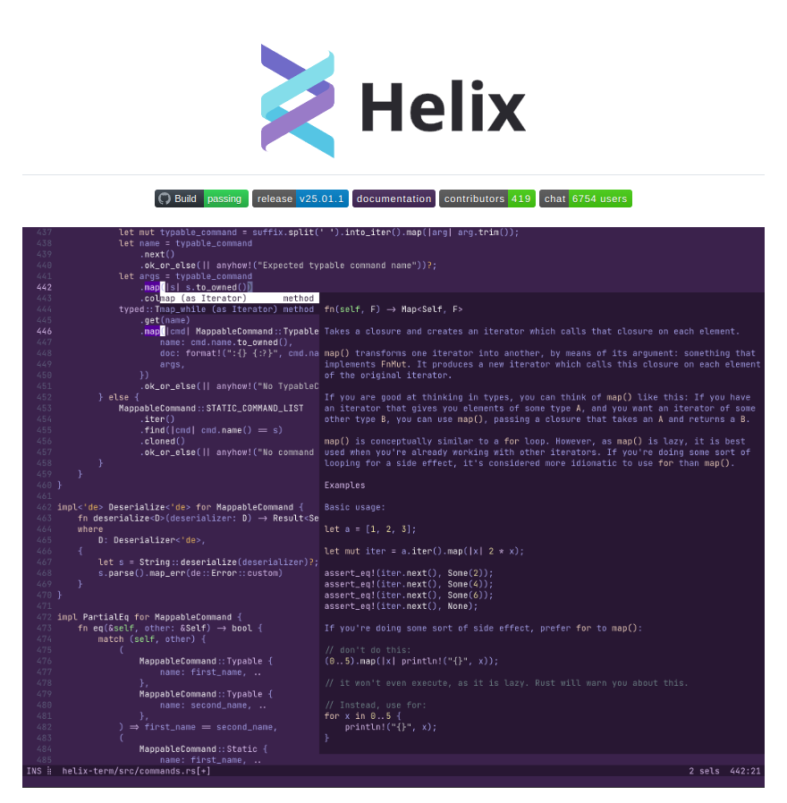

<!-- end_slide -->

## Zed Editor

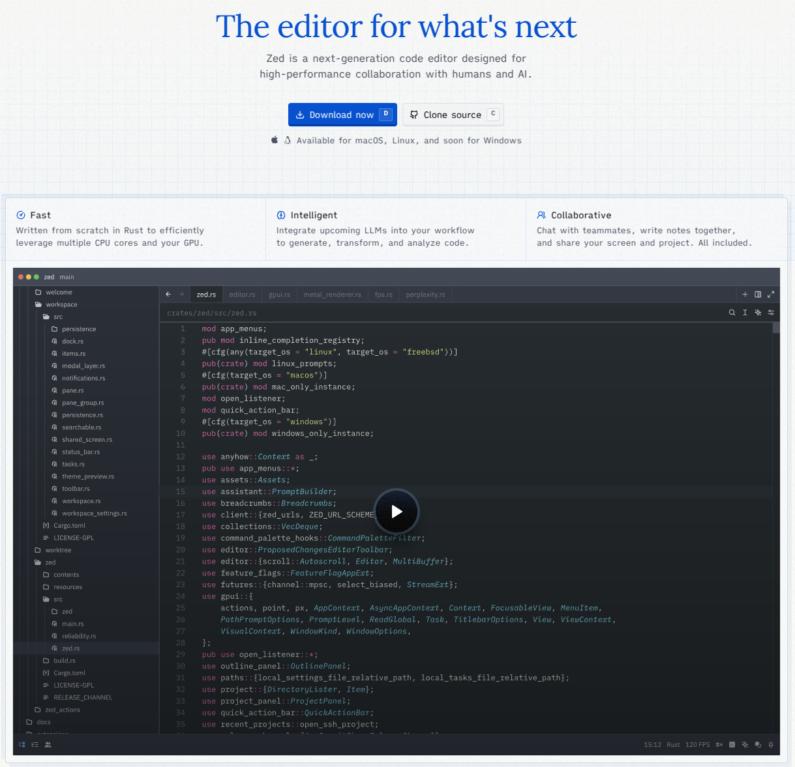

<!-- end_slide -->

## Ratatui


<!-- end_slide -->

# More awesome software 😎

<!-- jump_to_middle -->


https://github.com/rust-unofficial/awesome-rust
===

<!-- end_slide -->

## Materiały

### Książki 

- [The Rust Programming Language](https://doc.rust-lang.org/stable/book/)
- [Rust by Example](https://doc.rust-lang.org/stable/rust-by-example/)

### Pratkyka czyni mistrza - Rustlings

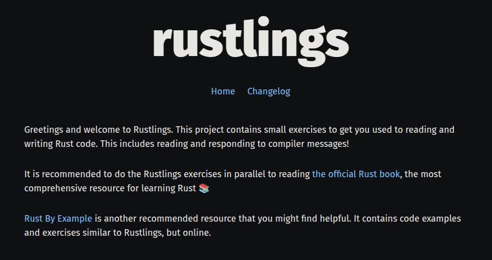

<!-- end_slide -->

<!-- jump_to_middle -->

Nie taki zardzewiały jak myślisz - odkryj potencjał Rusta
===

